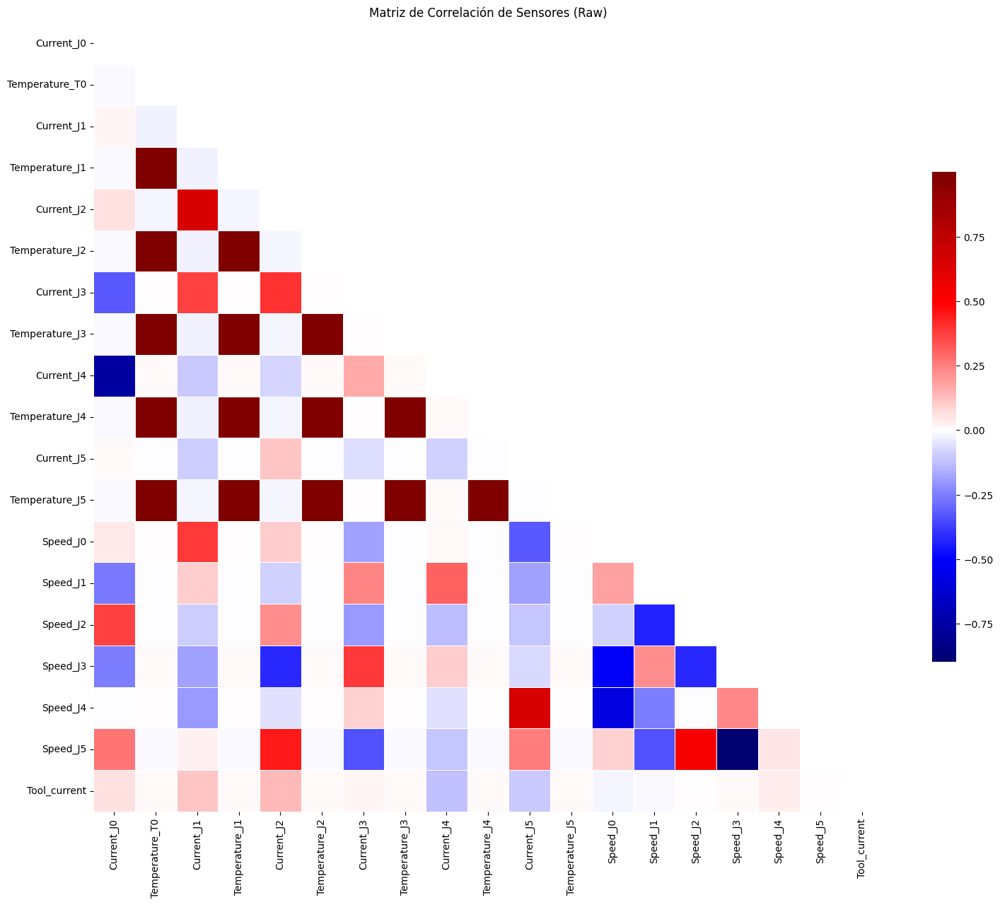

# Predicción de fallos en un robot UR3

Práctica final de **Aprendizaje Automático (APA)**, FIB – UPC (enero de 2026).
**Autores:** Víctor Ramírez Arimaha y Adrià Cebrián Ruiz

Detección y clasificación de fallos en un brazo robótico **UR3** a partir de las series temporales de los sensores de sus articulaciones. Es un problema de clasificación multiclase con clases muy desbalanceadas:

| Clase | Descripción |
|-------|-------------|
| 0 · OK | Funcionamiento normal |
| 1 · Grip Lost | El robot pierde el objeto que sujeta |
| 2 · Protective Stop | Parada de protección |

📄 **Informe completo:** [`APA_Final.pdf`](APA_Final.pdf)

## Dataset

- **7.409 muestras** repartidas en **240 ciclos** de operación, con una lectura por segundo.
- 6 articulaciones con corriente, temperatura y velocidad cada una, más la corriente de la herramienta.
- Solo ~3–4 % de las muestras son fallos de cada tipo.

## Metodología

- **Lag features:** cada instancia incluye las lecturas de los 5 instantes anteriores para capturar la dinámica del movimiento. El número de lags se eligió con un análisis de autocorrelación.
- **Separación por ciclos** (`GroupShuffleSplit` / `StratifiedGroupKFold`): un mismo ciclo nunca aparece a la vez en train y en test, para evitar *data leakage* temporal.
- **Desbalanceo:** `class_weight='balanced'`, oversampling / undersampling y SMOTE (ver [`code/class_imbalance.py`](code/class_imbalance.py)).
- **Modelos:** Regresión Logística, QDA, SVM lineal, SVM RBF, Random Forest y un MLP en PyTorch (hiperparámetros por Random Search), más ensembles de Stacking y Voting.

## Resultados (conjunto de test)

| Modelo | Tipo | Macro F1 | Rec. Grip | Prec. Grip | Rec. P. Stop | Prec. P. Stop |
|--------|------|:--------:|:---------:|:----------:|:------------:|:-------------:|
| Regresión Logística | Lineal | 0.37 | 0.80 | 0.10 | 0.66 | 0.11 |
| QDA | Lineal | 0.41 | 0.80 | 0.09 | 0.55 | 0.17 |
| SVM Lineal | Lineal | 0.48 | 0.27 | 0.23 | 0.28 | 0.22 |
| SVM (RBF) | No lineal | 0.57 | 0.59 | 0.28 | 0.30 | 0.49 |
| Random Forest | No lineal | 0.55 | 0.39 | 0.23 | 0.55 | 0.32 |
| **Red Neuronal (SMOTE)** | No lineal | **0.61** | 0.73 | 0.42 | 0.31 | 0.38 |

Los modelos no lineales superan de forma sistemática a los lineales. Como modelo final elegimos un **Voting Classifier (Random Forest + Red Neuronal + Regresión Logística)**: mantiene más de un 96 % de acierto en la clase OK y detecta aproximadamente la mitad de los fallos críticos. *Protective Stop* resulta la clase más difícil de predecir en casi todos los modelos.

<p align="center">
  
  
</p>

## Estructura del repositorio

```
.
├── APA_Final.pdf             # Informe final
├── code/
│   ├── notebook_final.ipynb  # Notebook principal: análisis, modelos y ensembles
│   ├── class_imbalance.py    # Estrategias de balanceo de clases
│   └── preproceso.py         # Preprocesado inicial y primera regresión logística
├── prestudio/
│   └── robot_dataset.ipynb   # Estudio preliminar (baseline Naive Bayes)
├── dataset/
│   ├── robot_dataset.csv     # Dataset utilizado
│   └── dataset_02052023.xlsx # Dataset original
└── graficos/                 # Figuras del informe (matrices de confusión, importancias...)
```

## Ejecución

Con [uv](https://docs.astral.sh/uv/):

```bash
uv sync
uv run jupyter lab code/notebook_final.ipynb
```

O con `pip`:

```bash
python3 -m venv .venv
source .venv/bin/activate        # En Windows: .venv\Scripts\activate
pip install -r requirements.txt jupyterlab
jupyter lab code/notebook_final.ipynb
```

Los notebooks usan rutas relativas, así que hay que ejecutarlos desde su propia carpeta (Jupyter lo hace por defecto).
